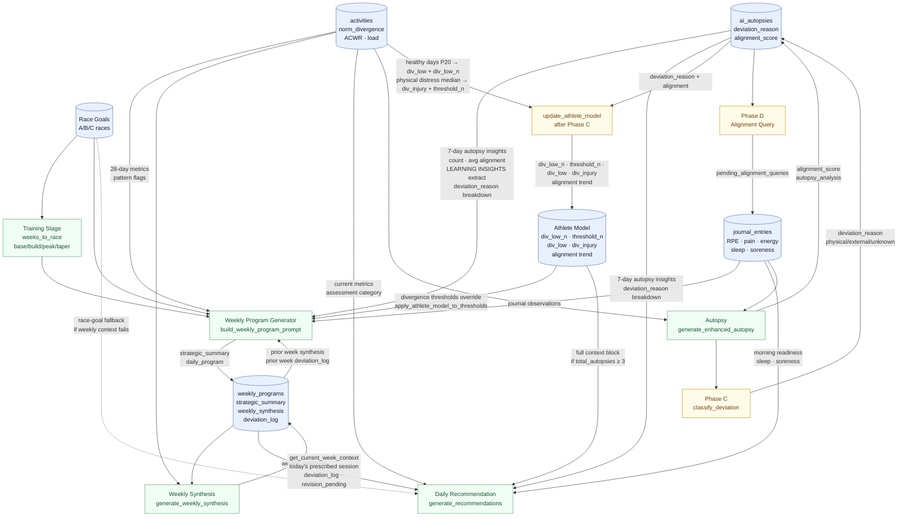

# YTM Coaching Pipeline — Data Flow

Generated 2026-03-22. Updated 2026-03-22 to reflect post-QC-audit plan (4-phase fix plan in `.claude/plans/jazzy-beaming-platypus.md`). Diagram represents the target state after all four phases are implemented. See QC Notes for resolved vs. remaining issues.

## Diagram

## QC Notes

### Resolved (post-audit plan)
- ~~**200-char truncation**~~: Both pipeline levels now use LEARNING INSIGHTS extract (300–500 chars) from `llm_recommendations_module.py:get_recent_autopsy_insights()` — Phase 2-A
- ~~**Athlete model gate on `acwr_sweet_spot_confidence`**~~: Gate now uses `total_autopsies ≥ 3`; misleading confidence counter replaced by `div_low_n`/`threshold_n` — Phase 3-B
- ~~**`deviation_reason` not injected**~~: Breakdown now included in autopsy context for both weekly and daily levels — Phase 2-B
- ~~**`deviation_log` not surfaced in daily prompt**~~: Weekly context block now includes deviation count and `revision_pending` flag — Phase 2-C
- ~~**Race goal signal lost on weekly context failure**~~: Direct `RG → DR` fallback (dashed edge) fires when `get_current_week_context()` raises an exception — Phase 1-A
- ~~**Dead ACWR sweet spot override**~~: Dead code path removed from `apply_athlete_model_to_thresholds()`; architecture is divergence-only — Phase 3-A

### Remaining
- **Autopsy short-circuits**: Raw autopsy insights inject directly into both Weekly Program and Daily Recommendation — the Athlete Model is not the sole conduit upward. By design; no change planned.
- **Weekly synthesis is post-processing**: `generate_weekly_synthesis()` runs after program generation, not before. The current week's program cannot reference its own synthesis — only the prior week's.
- **No formal cascade**: Weekly program and daily recommendation are generated independently from the same raw inputs. If race goals change mid-week, the daily recommendation doesn't update until the weekly program is manually regenerated.
- **Parallel daily paths**: `generate_recommendations()` (synchronous) and `generate_recommendations_agentic()` (tool-calling) are separate implementations — parity audit pending (Phase 4-C).

## Invariants

Constraints that must hold for the pipeline to function correctly. Violating any of these produces silent data corruption or broken calibration — the pipeline will continue to run but produce wrong results.

**Execution order**
- `update_athlete_model()` must run AFTER `classify_deviation()` in `save_journal_entry()`. Phase C writes `deviation_reason` to `ai_autopsies`; the threshold calibration query filters on that field. If order is reversed, `deviation_reason` is always null when thresholds are computed and `divergence_injury_threshold` never updates from its default.
- `generate_enhanced_autopsy()` must run BEFORE `classify_deviation()`. Phase C classifies the autopsy result — it cannot run before the autopsy exists.

**Athlete model calibration gates**
- `divergence_injury_threshold` only updates when N ≥ 3 physical-cause distress events exist (`deviation_reason = 'physical'` AND `normalized_divergence < typical_divergence_low`). Below that count, the default (0.15) applies silently — no log warning.
- `typical_divergence_low` only updates when N ≥ 5 qualifying healthy days exist (alignment ≥ 7, no pain, energy ≥ 3). Below that count, the default (-0.05) applies silently.
- `div_low_n` and `threshold_n` track these counts respectively. When both are at defaults, all downstream threshold overrides in `apply_athlete_model_to_thresholds()` are no-ops (values equal defaults).

**Athlete model context injection**
- `get_athlete_model_context()` injects the full context block only when `total_autopsies ≥ 3`. Below that, it returns a LEARNING notice. On exception, it returns an UNAVAILABLE notice. An empty string from this function means neither condition was met — this should not occur post-fix.
- `apply_athlete_model_to_thresholds()` is divergence-only. It overrides `divergence_overtraining` and `divergence_moderate_risk` from the athlete model. It does NOT override `acwr_high_risk` — that path was removed. Any future ACWR personalization requires new design.

**Weekly context and race goal signal**
- The daily recommendation's race goal signal flows through: `RG → WPG → WP → DR` (via weekly context). If `get_current_week_context()` fails, the fallback directly queries `RG` and injects race goals into the prompt. If that also fails, the daily recommendation runs without season goal context.
- The weekly program uses the prior week's `weekly_synthesis` — never the current week's. `generate_weekly_synthesis()` runs after program generation as post-processing. This is by design; do not change the order expecting the current week's synthesis to be available.

**Fallback autopsy**
- If `generate_enhanced_autopsy()` fails and the fallback is used, `update_athlete_model()` must be skipped for that autopsy. The fallback returns `is_fallback: True`; the call site checks this flag. Feeding the hardcoded fallback alignment score (6) into the weighted moving average pollutes `avg_lifetime_alignment`.

**Agentic path**
- `generate_recommendations_agentic()` is production-gated via `_is_feature_enabled('agentic_context', user_id)`. It is a separate implementation from `generate_recommendations()` — changes to one do not propagate to the other. Any prompt or context change made to the standard path must be assessed for parity in the agentic path.

## Key Files

| Node | File | Function |
|------|------|----------|
| Weekly Program Generator | `app/coach_recommendations.py` | `build_weekly_program_prompt()`, `generate_weekly_program()` |
| Weekly Synthesis | `app/coach_recommendations.py` | `generate_weekly_synthesis()` |
| Daily Recommendation | `app/llm_recommendations_module.py` | `generate_recommendations()` |
| Autopsy | `app/llm_recommendations_module.py` | `generate_enhanced_autopsy()` |
| Phase C | `app/llm_recommendations_module.py` | `classify_deviation()` |
| Athlete Model Update | `app/llm_recommendations_module.py` | `update_athlete_model()` |
| Athlete Model Context | `app/llm_recommendations_module.py` | `get_athlete_model_context()` |
| Weekly Context Injection | `app/db_utils.py` | `get_current_week_context()` |
| Threshold Override | `app/llm_recommendations_module.py` | `apply_athlete_model_to_thresholds()` |
